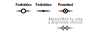
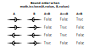

# Ponderings

## 1.0 - Anatomy of an Interval Object

### 1.1 Constructing an Interval
An `Interval` is an ordered pair of `Bound`s.
Each `Bound` specifies the floating point value of the endpoints of the interval and also define weather the bounds themselves form part of the interval:

```python
from NicksIntervals.Interval import Interval
from NicksIntervals.Bound import Bound, PART_OF_LEFT, PART_OF_RIGHT

my_first_interval = Interval(
	Bound(
		0.5,
		PART_OF_RIGHT
	),
	Bound(
		1.0,
		PART_OF_LEFT
	)
)
# Equivalent to the following:
my_first_interval = Interval.closed(0.5, 1.0)
```

A less confusing way to construct intervals is to use the factory functions:

```python
# both bound values are part of the interval:
my_interval = Interval.closed(0.5, 1.0)

# neither of the bound values are part of the interval
my_interval = Interval.open(0.5, 1.0)

# only the right bound is part of the interval (the exact value 0.5 is excluded)
my_interval = Interval.open_closed(0.5, 1.0)

# only the left bound is part of the interval (the exact value 1.0 is excluded)
my_interval = Interval.closed_open(0.5, 1.0)
```
### 1.2 Bound
Bounds represent a floating point value, augmented with a direction; left, or right. 

**Bound.value**

Bounds support coersion to float and comparison opperators. The float value can be explicitly obtained using Bound(...).value.

**Bound.part_of_left / Bound.part_of_right**

Internally the bound direction represented by a single boolean value which is the second parameter to the constructor. To improve the readability of usercode it is reccomended that you import the following constants from the Bound module for use in constructing an Bound:
```python
# Signifies that a bound is part of the interval to the left of it's value:
PART_OF_LEFT = False
b1 = Bound(1.0, PART_OF_LEFT)

# Signifies that a bound is part of the interval to the right of it's value:
PART_OF_RIGHT = True
b2 = Bound(1.0, PART_OF_RIGHT)
```
***

## 2.0 Working with Intervals:
### 2.1 Opperations on Intervals

> NOTE:
> Any Interval operation or transformation that may return no result, a single interval, or multiple intervals will return an `Iterable[Interval]`

> ALSO NOTE:
> Interval impliments `.__iter__()`, therfore it is always safe to iterate over the result of interval opperations without the need to check for null.

<span style="color:yellow; background-color:black;">TODO: List implimented operations </span>

Supported functions
 - Interval.contains_value
 - Interval.contains_interval

### 2.2 Infinite Bounds
Bounds defined at -infinity must be `PART_OF_RIGHT`

Bounds defined at +infinity must be `PART_OF_LEFT`


Bounds at -infinity and +infinity are used to define the `left_exterior` and `right_exterior` region of an interval or list of bounds.
- If the first bound of an interval is at -infinity, its `left_exterior` is an empty `tuple`.
- If the second bound of an interval is at +infinity, its `right_exterior` is an empty `tuple`.
- `exterior.left_exterior for exterior of Interval(...).left_exterior === tuple()`

```python
# where:
m = Interval.closed(5,10)
# then:
m.left_exterior === (Interval(Bound(float('-inf'), PART_OF_RIGHT),Bound(5, PART_OF_RIGHT)),)
m.right_exterior === (Interval(Bound(10, PART_OF_LEFT), Bound(float('inf'), PART_OF_LEFT)),)

m.exterior === tuple(m.left_exterior, m.right_exterior)
```

## 3.0 Lists of Bounds

Any pair of bounds can completly define an Interval object. An ordered list of bounds defines a segmentation of the real number line into interval objects. This is illustrated below where 5 bounds define 4 intervals which completely cover the Real Number line:

>

### List[Bounds] is a strict 1:1 mapping
Because Bounds must be PART_OF_LEFT or PART_OF_RIGHT, they cannot be _'part of both'_ intervals, or _'part of neither'_. The effect of this restriction is that, for a `sorted(List[Bound])`;
- The `Intervals` defined by each consecutive pair of Bounds are a strict 1:1 mapping to the real number line (there are no gaps or overlaps).
- A single number can be represented by a Zero length 'degenerate' interval as shown in the image below.
- a missing instantaneous value is not possible.
- it will not be possible to have more than 2 bounds with the same value. Creating an interval between them would trigger the error 'Degenerate intervals (of length==0) must be closed on both bounds'




_Figure XX - Forbidden and Permitted bounds when using a `List[Bounds]` datastructure_

This datastructure is not suitable if there is a need to represent overlapping intervals. Instead, a list of independant interval objects is required: `List[Interval]`

### Bound Order
Bounds can be compared with `<`, `>` and `==`. The truth table below is used:
>

This sort order is arbitrary, but was selected such that 
```python
a = Bound(...)
b = Bound(...)
x = sorted([a, b])
#will yield a 
valid_degenerate = Interval(x[0], x[1]) if x[0]!=x[1] else None
```
### Linked_Bound Order
Linked bounds contain an additional piece of information which tells us if they are an upper or lower bound.

The same bound order is used, but an additional tie-breaker is introduced:

This introduces a possible tie-breaker; if two bounds are equal and have the same direction, then
upper bounds are less than lower bounds.
 

Linked bounds are only equal if the values `isclose()`, the direction is equal, and they are both upper or both lower bounds.

## 4.0 Lists of Intervals

Lists of intervals can be used when each interval object is independant and may be allowed to overlap.

### Floating Point wierdness
Floating point number wierdness is handled using python math.isclose()


In building this model to represent intervals, the following properties are desireable
 1. When dealing with a collection of intervals there must be two modes:
    - A complete two way mapping is enforced. There are no real number values  which do not have a corresponding interval in the output space.
 2. 


Bounds are directed; they denote which interval the value AT the bound is treated.


## 5.0 Contains Value

To determine if a given python floating point number, X,
is contained by an interval, the following process is followed:

First the value of two bounds are obtained; lowerBound and upperBound
the python math.isclose(...) function is used to test for 'equality' to X
math.isclose(X, lowerBound) or math.isclose(X, upperBound)
If X is 'isclose' to the bound and the bound is closed, X is part of the interval.
otherwise the result is determined by the expression
'lower_bound<X<upper_bound'

## Test if an Interval Contains an Interval


```python
int_a = Interval(...)
int_b = Interval(...)
int_a.contains_interval(int_b) = ??
```

When the bound of one interval `math.isclose()` to the bound of another interval, there the truth table below is consulted to see if the bound is contained within the interval. Otherwise the if `int_a.start<the_bound<int_a.end` then the bound is contained within the interval. Otherwise the bound is not contained. Finally, if both bounds of an_interval are contained within another_interval, then `another_interval.contains(an_interval)==True`

Truth Table
|Interval|🡆	|Upper|	|Lower|	|
|---|---|---|---|---|---|
|Contains|🡇	|open	|closed	|open	|closed	|
|Upper	|open	|T		|T		|F		|F		|
|		|closed	|F		|T		|F		|T		|
|Lower	|open	|F		|F		|T		|T		|
|		|closed	|F		|T		|F		|T		|


Visualised:

